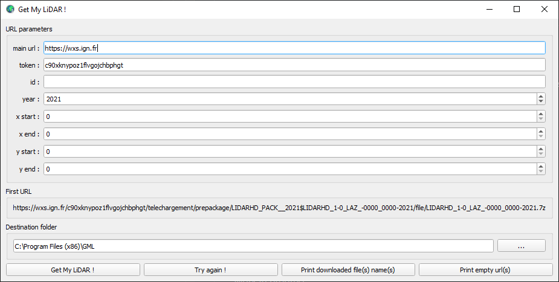

# GML - Get My LiDAR !

**GML** est un outil permettant de télécharger facilement un ensemble de dalles LiDAR HD de l'IGN d'un même bloc. 

1. [Télécharger GML pour votre OS](#Télécharger-GML-pour-votre-OS)
2. [Comment utiliser GML](#Comment*-utiliser-GML)
3. [Instructions pour exécuter GML depuis le code source](#Instructions-pour-exécuter-GML-depuis-le-code-source)

## Télécharger GML pour votre OS

- [Installateur pour Windows 10](https://sourceforge.net/projects/get-my-lidar/files/GML_22-07.exe/download)
- [Version portable for Windows 10](https://sourceforge.net/projects/get-my-lidar/files/GML_22-07.zip/download)

## Comment utiliser GML

<div id="header" align="center">
  
</div>

- Configurez les différents champs pour construire l'url d'accès aux données.
- Choississez le répertoire où seront écrites les données téléchargées.
- Lancez le téléchargement avec la commande **Get My LiDAR !**.
- Si certains téléchargements ont échoués, vous pouvez relancer le téléchargement des fichiers manquants avec la commande **Try again !**.
- La commande **Print downloaded file(s) name(s)** permet d'afficher le nom des fichiers téléchargés.
- La commande **Print empty url(s)** permet d'afficher l'url des fichiers non téléchargés.

## Instructions pour exécuter GML depuis le code source

1. Installez *Conda* pour votre système d'exploitation: [miniconda](https://docs.conda.io/en/latest/miniconda.html).
2. Téléchargez le code source de **GML** : [GML-main](https://github.com/clementroussel/GML/archive/refs/heads/main.zip).
3. Décompressez l'archive et gardez uniquement les répertoires *src* et *requirements*.
4. Ouvrez *Conda Powershell Prompt* and déplacez vous dans le répertoire *GML-main*.
5. Créez et activer un environnement virtuel dédié à **GML**:

    ```conda create --name gml python=3.6```  
    ```conda activate gml```

6. Installez les dépendances du projet:

    ```pip install -r requirements/base.txt```

7. Lancez **gml**:

    ```fbs run```